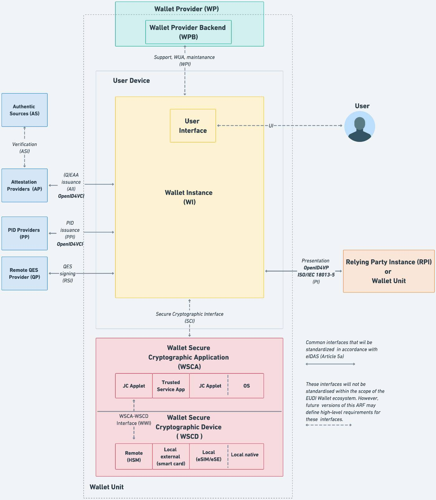

# ALTME & TALAO — EU Digital Identity Wallet Implementations for Holders

**ALTME** = **TALAO** + **crypto wallet**

## Overview

**ALTME** and **TALAO** are open-source implementations of the **EU Digital Identity Wallet Architecture and Reference Framework (ARF)**, focused on the **Holder** role. These wallets are developed to align with **eIDAS 2.0**, enabling secure and privacy-preserving identity credential management within the European regulatory framework.

They are designed to support standardized credential issuance, presentation, and cryptographic operations as required for ARF compliance.

---

## Conformance with ARF

ALTME and TALAO implement all major holder-side components defined by [ARF 1.10.0](https://eu-digital-identity-wallet.github.io/eudi-doc-architecture-and-reference-framework/1.10.0/architecture-and-reference-framework-main/):

- **Wallet Instance (WI)** for secure credential handling
- **Wallet Provider (WP)** and **Wallet Provider Backend (WPB)** for distribution, support, and maintenance
- **Wallet Secure Cryptographic Application (WSCA)**: phone OS
- **Wallet Secure Cryptographic Device (WSCD)** for compliant cryptographic operations: phone native  
- Secure communication with:
  - **Authentic Sources (AS)**
  - **Attestation Providers (AP)**
  - **PID Providers (PP)**
  - **Remote QES Providers (QP)**
  - **Relying Parties (RPIs)**

> ⚠️ **Note:** The ISO/IEC 18013-5 standard (mDL presentation) is **not yet implemented**.

---

## Supported Standards

| Specification                                | Purpose |
|---------------------------------------------|---------|
| [W3C VC Data Model 2.0](https://www.w3.org/TR/vc-data-model-2.0/) | Model for interoperable, tamper-evident verifiable credentials |
| **SD-JWT-based Verifiable Credentials**      | Credentials enabling selective disclosure and privacy preservation |
| **OpenID4VCI**                               | Credential issuance protocol |
| **OpenID4VP**                                | Credential presentation protocol |
| **eIDAS 2.0 (Article 5a)**                   | Interoperability and legal compliance within the EU digital identity ecosystem |

---

## Architecture

The architecture shown above describes the full integration of components as specified in the ARF:

- **Wallet Instance (WI)** runs securely on the user’s device
- **Secure Cryptographic Interface (SCI)** connects to hardware security modules or secure elements (HSM, smartcard, eSIM, native)
- Trust relationships with issuing and verifying parties are built through standardized, open protocols
- The **User Interface (UI)** allows the holder to manage credentials and consent to transactions

This modular design ensures both **compliance** and **interoperability** with EU digital identity infrastructure.

Currently, the wallet is non-custodial, meaning users retain full control over their credentials and private keys. Those keys and credentials are stored securely on the device, ensuring privacy and security:
- Keychain is used for iOS
- AES encryption and SharedPreferences are used for Android. AES secret key is encrypted with RSA and RSA key is stored in KeyStore

---

## Wallet features

### Protocols
* OIDC4VC:
  * OIDC4VCI Draft 11 and 13,
  * OIDC4VP Draft 20,
  * SIOPV2 Draft 12
* W3C Verifiable presentation request,
* VC formats:
    * ldp_vc, jwt_vc_json, jwt_vc_json-ld,
    * vc+sd-jwt vc.
#### OIDC4VCI
* Flows : authorization code flow, pre-authorized code flow with Tx, PAR,
* credential_offer_uri,
* issuer endpoints supported : credential, deferred, nonce
* wallet attestations, PKCE, scope and authorization details,
* client authentication methode : anonymous, client_id, client secret basic, client secret post, jwt,
* identifier : jwk thumbprint, did:key, did:jwk,
* proof type : jwt, ldp_vp.
#### OIDC4VP
* client_id_scheme : did, verifier_attestation, X509, redirect_uri,
* presentation_definition and presentation_definition_uri,
* request object and request_uri,
* direct_post and direct_post.jwt,
* PEX 2.0 partial.
#### Signature suites
JWT: ES256, ES256K, EdDSA, RSA
linked data proof : Ed25519Signature2018, Ed25519Signature20, Secp256r1Signature2019, EcdsaSecp256r1Signature2019, RsaSignature2018.
#### Other features
* Bitstring status list 1.0 and IETF token status list,
* OIDC4VC Embedded profiles: HAIP, EBSI-V3 (compliant wallet), DIIP V2.1, DIIP V3.0,
* Talao DID resolver for did:web, did:ethr, did:ebsi, did:dht, did:sov, did:cheqd...,
* wallet user authentication : PIN and biometric, ACL
* user chat and notification through Matrix.org,
* developer mode for internal data and protocol requests and responses,
* embedded issuers for PID, email proof, phone proof, age proof with AI or document authentication.
## Altme Wallet features
* Same features as Talao wallet,
* blockchain support: Tezos, Ethereum, Polygon, Fantom, BNB, Etherlink,
* send/receive crypto, token, NFT,
* buy crypto with Wert.io
## Accessibility
We have many accessibility elements implemented by the Flutter development framework that we use, especially for screen readers. Namely that as standard the phone's accessibility settings are taken into account:

* TalkBack (Android) and VoiceOver (IOS)
* BrailleBack on Android
* Dynamic font size
* Contrast management
* "Invert colors" mode, Light and Dark built-in themes
* Addition of custom themes
* Focus support for navigation
* Accessible gesture management

The wallet supports screen readers, keyboard navigation, high contrasts and text adaptation.

## GDPR
We are committed to ensuring your data protection rights are upheld in accordance with the General Data Protection Regulation (GDPR). We protect the important rights under the GDPR, and we assist users to exercising them:

* The Right to Access, Update, or Delete: Users can access, update, or request the deletion of their Personal Data directly within their account settings on our platform. If they need assistance with these actions, they can access the support by email and through the app itself.
* The Right of Rectification: If they believe their Personal Data is inaccurate or incomplete, they have the right to request corrections.
* The Right to Object: They can object to the processing of their Personal Data.
* The Right of Restriction: Request the restriction of the processing of their Personal Data when necessary.
* The Right to Data Portability: Obtain a copy of your Personal Data in a structured, machine-readable format.
* The Right to Withdraw Consent: If we rely on their consent to process their Personal Data, they have the right to withdraw it at any time.

In order to allow users to assert their rights, we have set up numerous means of communication between the user and the wallet provider. These technical means are also respectful of their privacy and for this reason are supported in the wallet itself by decentralized tools, in particular by a chat built on https://matrix.org/ and an integrated email. The privacy policy is available in the wallet itself and on our website at https://talao.io/privacy/ .

## Project Installation

Please follow the step-by-step installation guide here:  
👉 [Installation Guide](https://github.com/TalaoDAO/AltMe/blob/master/doc/installation.md)

---

## License

This project is released under the **Apache License 2.0**. See the [LICENSE](LICENSE) file for full terms.

---

## Further Reading

- [EU Digital Identity Wallet ARF](https://eu-digital-identity-wallet.github.io/eudi-doc-architecture-and-reference-framework/)
- [W3C VC Data Model 2.0](https://www.w3.org/TR/vc-data-model-2.0/)
- [SD-JWT Draft (IETF)](https://www.ietf.org/archive/id/draft-ietf-oauth-selective-disclosure-jwt-07.html)

---

**Maintained by [WEB3 DIGITAL WALLET](https://github.com/TalaoDAO) — Contributor to decentralized identity standards and European digital identity infrastructure.**
